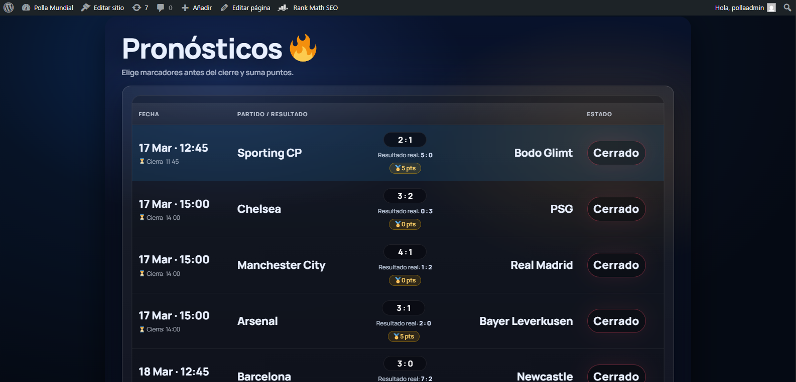
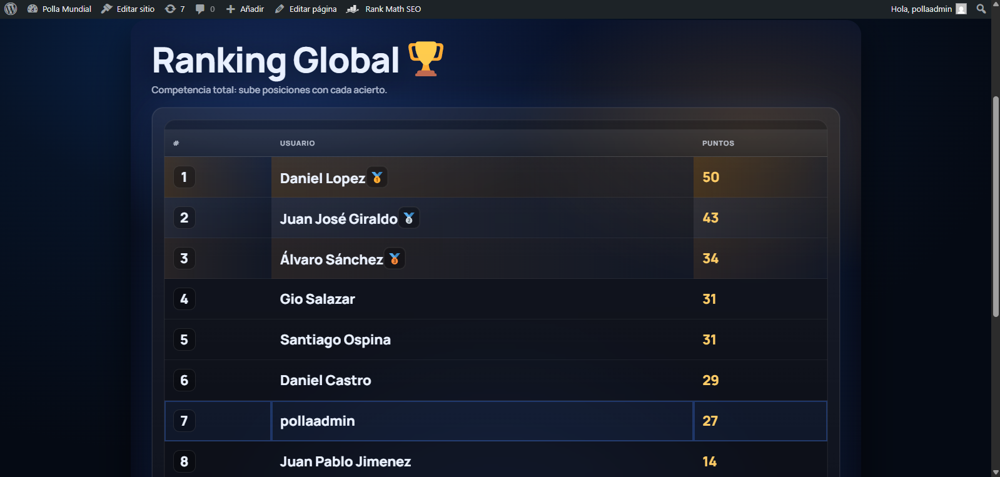

# ⚽ World Cup Betting Plugin (WordPress)

A custom WordPress plugin built in PHP that allows users to participate in a World Cup prediction game with real-time scoring, leaderboards, and private leagues.

## 🚀 Features

- Team and match management (admin panel)
- User match predictions
- Automatic scoring system
- Global leaderboard
- Private leagues with invitation codes
- Special predictions (champion, runner-up, top scorer)

## 🛠️ Tech Stack

- PHP (WordPress Plugin Development)
- MySQL
- HTML/CSS (WordPress frontend)
- Git & GitHub

## 📌 Key Technical Highlights

- Custom database tables using `$wpdb`
- Automated scoring engine
- Class-based architecture
- WordPress shortcodes integration
- Real-time ranking updates

## 🎯 Project Status

Active development – MVP already in use with real users.

## 📷 Demo

### Home

### Predictions

### Leaderboard

## 👨‍💻 Author

David Sánchez